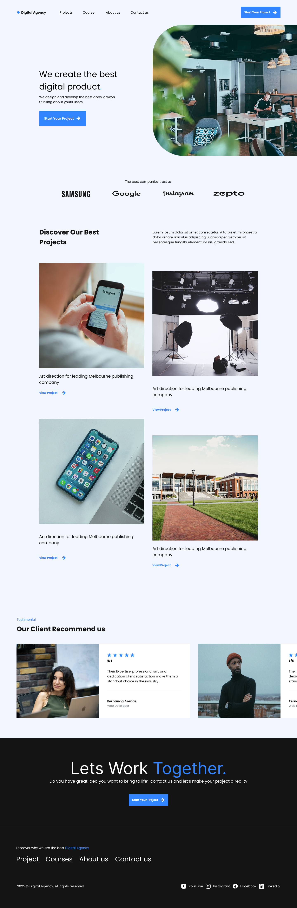

# Digital-Agency-UI-Design

## Project Overview
A modern landing page design for a digital agency.

## Tools Used
- Figma

## Design Process
1. Low Fidelity Wireframing
2. Design System Creation
3. High Fidelity UI Design

## Deliverables
- Design System
- Low Fidelity Wireframe
- High Fidelity Design

## Prototype Link
https://www.figma.com/proto/CcKmxwYQW1xt4ANWaBijpO/Digital-Agency-Project?node-id=1-3&p=f&viewport=-695%2C163%2C0.21&t=nG6YshilU2Zg3d9V-1&scaling=min-zoom&content-scaling=fixed&page-id=0%3A1

## Design Screens

### Final Design

